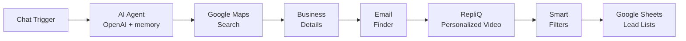
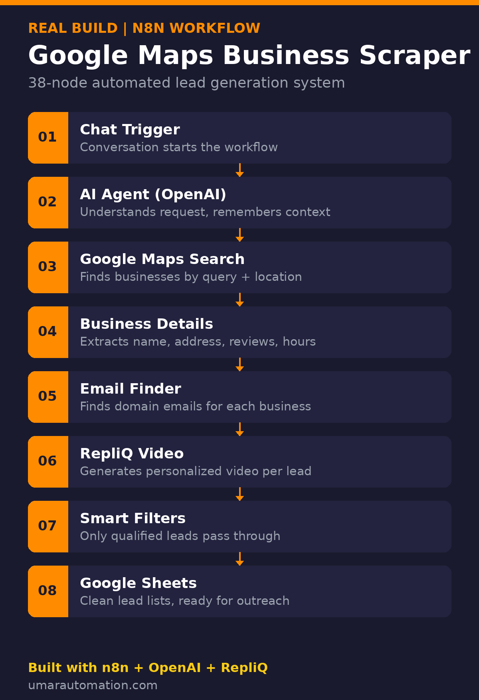

# Google Maps Business Scraper (n8n)

A 38-node n8n pipeline that turns a chat message into an enriched business dataset: an AI agent interprets the request, extracts Google Maps listings, enriches each business with contact emails and a personalized video, filters, and writes clean lists to Google Sheets.

## Problem

Building a targeted business dataset by hand means opening dozens of Maps listings, copying names, addresses, and reviews, hunting down emails one domain at a time, and pasting everything into a spreadsheet. Slow, error-prone, and impossible to repeat at scale.

## How It Works

Send a chat message like "dental clinics in Austin" and the pipeline runs 8 stages:

| # | Stage | What happens |
|---|-------|--------------|
| 1 | Chat Trigger | A conversation starts the workflow |
| 2 | AI Agent (OpenAI) | Parses the request (query + location); keeps context across messages via memory |
| 3 | Google Maps Search | Finds matching businesses for the query + location |
| 4 | Business Details | Extracts name, address, reviews, hours per listing |
| 5 | Email Finder | Resolves domain emails for each business |
| 6 | RepliQ Video | Generates a personalized video per record |
| 7 | Smart Filters | Drops records that miss qualification criteria |
| 8 | Google Sheets | Appends clean, structured rows to lead lists |

## Tech Stack

| Component | Purpose |
|---|---|
| n8n (38 nodes) | Orchestration |
| OpenAI (AI Agent + memory) | Natural-language request parsing, conversation context |
| Google Maps extraction | Business discovery + details |
| Email finder | Domain email resolution |
| RepliQ API | Personalized video generation |
| Google Sheets | Structured output |

## Build It Yourself

The import-ready workflow file is private, but the architecture above is complete enough to rebuild:

1. **Trigger**: n8n Chat Trigger feeding an AI Agent node (OpenAI chat model + window memory).
2. **Search tools**: give the agent two tools \u2014 a Maps search (query + location \u2192 listings) and a details fetcher (listing \u2192 name/address/reviews/hours). HTTP Request nodes against a Maps scraping API work here.
3. **Enrichment**: per business, resolve the website domain \u2192 email-finder API \u2192 contact emails.
4. **Personalization**: call the RepliQ API per record to render a personalized video; store the video URL.
5. **Filter**: IF/Filter nodes drop records missing emails or below review thresholds.
6. **Output**: a Google Sheets node appends qualified rows (name, address, phone, email, reviews, video URL).

## Capabilities

- Natural-language input ("plumbers in Lahore") instead of manual form-filling
- Structured output per business: name, address, reviews, hours, email, personalized video URL
- Repeatable: same query \u2192 a fresh, deduplicated list every run

## Notes

- Respect Google Maps' Terms of Service and rate limits; use an official or licensed scraping API for production use.
- The import-ready `workflow.json` is not published (private build); this repo documents the architecture.

## License

MIT \u2014 architecture and docs are free to learn from and rebuild.
